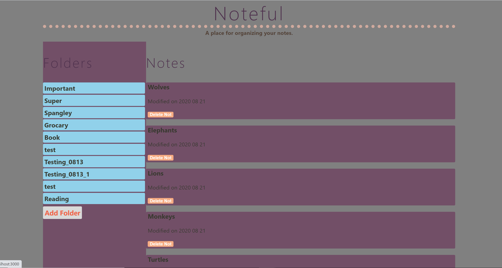
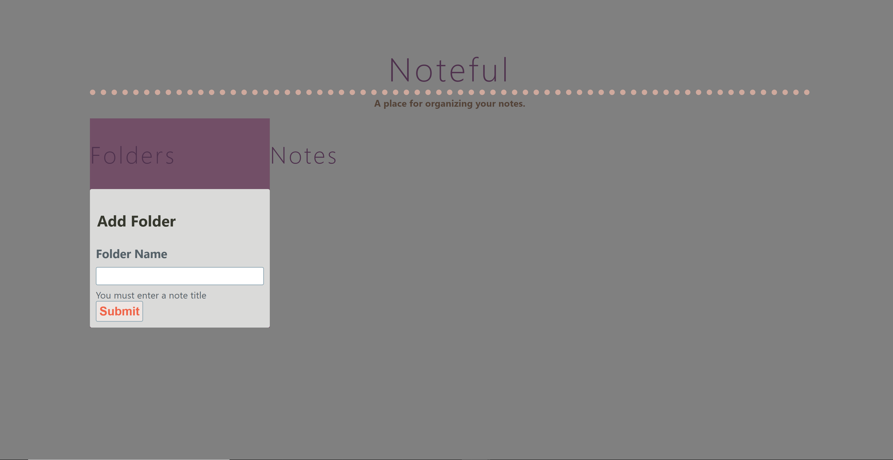
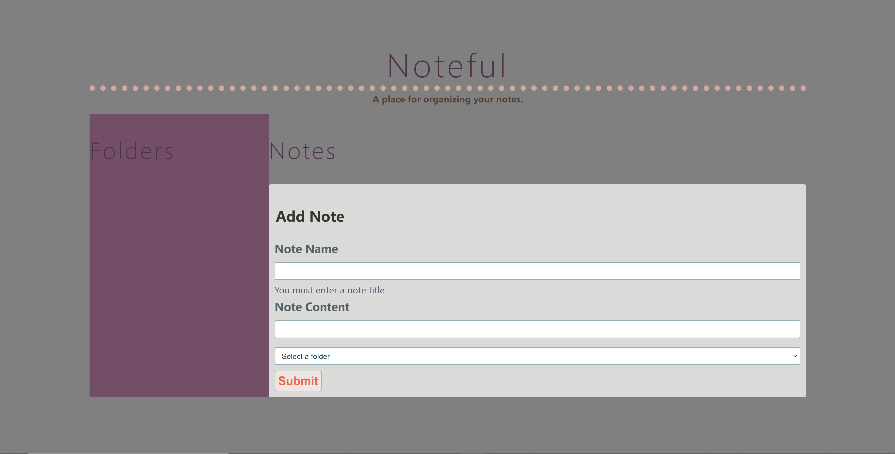
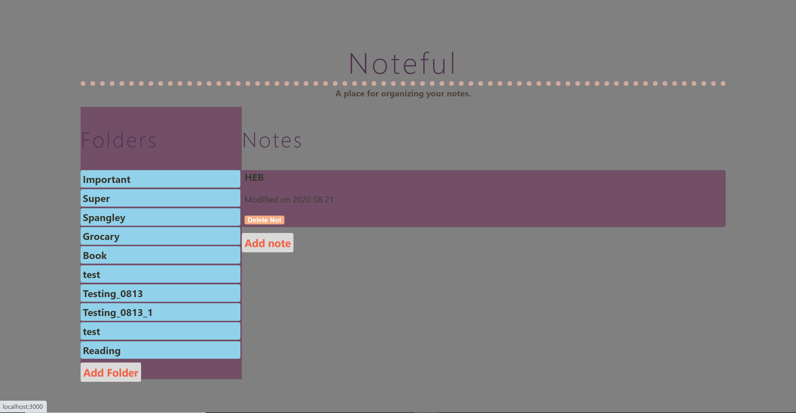

# Noteful

### Purpose
Notefull is a full stack web application for <b>note-taking</b> who wants to organize their notes. The application lets users manage and organize their notes, which are stored on an external server.

### Motivation
This was created to practice developing and thinking in React, including unit testing and tying the app to a backend server (see here: https://github.com/SultanaK/Noteful-Server)

### Working Prototype
[Noteful API Repo](https://github.com/SultanaK/Noteful-Server)

[Noteful-App React Repo](https://github.com/SultanaK/notefull-app)

[Live Noteful Application](https://noteful-app-five-theta.vercel.app/)

### Live Screenshots

**Noteful Landing Page**

**Add Folder Page**

**Add Note Page**

**Folder View**

### Technology Used

<b>Front End</b>
* HTML5
* CSS3
* JavaScript
* React
* Enzyme
  
<b>Back End</b>
* Node.js
* Express.js
* PostgreSQL
*  Chai, Mocha, Supertest

### Scripts

Install node modules `npm install`

Start the application `npm start`

### Running the app
To run this app, you'll need to point it at a noteful API. By default, this app expects to find the API running at http://localhost:8080.

If you need to point it elsewhere, you can do this by modifying <meta name="API_ROOT" content="http://localhost:8080"> in the index.html file.

To run locally, you can use http-server or an equivalent. Keep in mind that the client will need to run on a different port than the API. So with http-server, you might run http-server -p 8081.

### Future App Enhancements
* Better formatting on mobile (app is responsive but not optimized for mobile - especially the Add Note / Add Folder windows)
* Hook up delete folder endpoint to the app so users can delete folders
* Implement poteceted endpoint.
